# Facebook OAuth Setup Guide

## Overview

Workflow ini menggunakan **Facebook Login** (bukan Instagram Business Login) untuk mendapatkan akses ke Instagram Business Account ID yang diperlukan untuk webhooks.

## OAuth Flow

```mermaid
graph LR
    A[User clicks Login] --> B[Redirect to Facebook OAuth]
    B --> C[User authorizes]
    C --> D[Facebook redirects with code]
    D --> E[Exchange code for short-lived token]
    E --> F[Exchange for long-lived token]
    F --> G[Get Facebook Pages]
    G --> H[Get Instagram Business Account]
    H --> I[Save to Supabase]
    I --> J[Redirect to app]
```



## Initial OAuth URL

Untuk memulai OAuth flow, redirect user ke URL ini:

```
https://www.facebook.com/v24.0/dialog/oauth?client_id=729483593108466&redirect_uri=https://irisnco.app.n8n.cloud/webhook/instagram-callback&scope=pages_show_list,instagram_basic,instagram_manage_messages,instagram_manage_comments,pages_read_engagement&response_type=code
```

### Parameters:

| Parameter       | Value                                                                                                       | Description                       |
| --------------- | ----------------------------------------------------------------------------------------------------------- | --------------------------------- |
| `client_id`     | `729483593108466`                                                                                           | Facebook App ID                   |
| `redirect_uri`  | `https://irisnco.app.n8n.cloud/webhook/instagram-callback`                                                  | n8n webhook URL                   |
| `scope`         | `pages_show_list,instagram_basic,instagram_manage_messages,instagram_manage_comments,pages_read_engagement` | Required permissions              |
| `response_type` | `code`                                                                                                      | OAuth 2.0 authorization code flow |

### Required Scopes:

- `pages_show_list` - To list user's Facebook Pages
- `instagram_basic` - Basic Instagram account info
- `instagram_manage_messages` - To receive and respond to messages
- `instagram_manage_comments` - To receive and respond to comments
- `pages_read_engagement` - To access Page insights

## Workflow Nodes

### 1. Webhook - Instagram Callback

- Receives OAuth callback with `code` parameter
- Extracts code from query string: `{{ $json.query.code }}`

### 2. Exchange Code for Short-Lived Token

- **Endpoint**: `https://graph.facebook.com/v24.0/oauth/access_token`
- **Method**: POST (form-urlencoded)
- **Parameters**:
  - `client_id`: Your Facebook App ID
  - `client_secret`: Your Facebook App Secret
  - `grant_type`: `authorization_code`
  - `redirect_uri`: Must match OAuth URL
  - `code`: From webhook query
- **Returns**: Short-lived access token (expires in ~2 hours)

### 3. Exchange for Long-Lived Token

- **Endpoint**: `https://graph.facebook.com/v24.0/oauth/access_token`
- **Method**: GET
- **Parameters**:
  - `grant_type`: `fb_exchange_token`
  - `client_id`: Your Facebook App ID
  - `client_secret`: Your Facebook App Secret
  - `fb_exchange_token`: Short-lived token from step 2
- **Returns**: Long-lived access token (expires in ~60 days)

### 4. Get Facebook Pages

- **Endpoint**: `https://graph.facebook.com/v24.0/me/accounts`
- **Method**: GET
- **Parameters**:
  - `access_token`: Long-lived token from step 3
- **Returns**: Array of Facebook Pages user manages
- **Data used**: Takes first Page ID (`data[0].id`)

### 5. Get Instagram Business Account

- **Endpoint**: `https://graph.facebook.com/v24.0/{page_id}`
- **Method**: GET
- **Parameters**:
  - `fields`: `instagram_business_account{id,username,name,profile_picture_url}`
  - `access_token`: Long-lived token
- **Returns**: Instagram Business Account details with Account ID (`17841...`)

### 6. Save to Supabase

Saves the following fields to `instagram_accounts` table:

- `instagram_user_id`: Instagram Account ID
- `instagram_business_id`: Instagram Account ID (legacy compatibility)
- `instagram_account_id`: Instagram Account ID (for webhooks)
- `username`: Instagram username
- `full_name`: Instagram account name
- `avatar_url`: Profile picture URL
- `access_token`: Long-lived Facebook access token
- `token_expires_at`: Token expiration timestamp
- `updated_at`: Current timestamp

### 7. Redirect to App

Redirects user back to app with success parameters:

```
http://localhost:3000?instagram_connected=true&username={username}
```

## Frontend Integration

Di aplikasi Next.js, tambahkan button untuk memulai OAuth:

```tsx
<a
  href="https://www.facebook.com/v24.0/dialog/oauth?client_id=729483593108466&redirect_uri=https://irisnco.app.n8n.cloud/webhook/instagram-callback&scope=pages_show_list,instagram_basic,instagram_manage_messages,instagram_manage_comments,pages_read_engagement&response_type=code"
  className="btn btn-primary"
>
  Connect Instagram Account
</a>
```

## Environment Variables

Pastikan environment variables berikut tersedia di n8n atau .env:

```env
FACEBOOK_APP_ID=729483593108466
FACEBOOK_APP_SECRET=230f07cb7e58c62cdda5150a6a66ed02
FACEBOOK_REDIRECT_URI=https://irisnco.app.n8n.cloud/webhook/instagram-callback
```

## Testing

1. Klik "Connect Instagram Account" button di app
2. Login dengan Facebook account yang manage Instagram Business Account
3. Authorize aplikasi
4. Verify di Supabase bahwa `instagram_account_id` terisi dengan format `17841...`
5. Check UI menampilkan Account ID dengan benar

## Troubleshooting

### Error: "Invalid OAuth access token"

- Pastikan menggunakan Facebook OAuth, bukan Instagram Business Login
- Verify scopes include `pages_show_list`
- Check token belum expired

### Error: "Cannot parse access token"

- Token dari Instagram Business Login tidak bisa dipakai untuk Facebook Pages API
- Harus pakai Facebook Login endpoint

### No Instagram Business Account found

- User harus punya Facebook Page yang connected ke Instagram Business Account
- Verify di Facebook Business Settings: Settings → Instagram → Connected Accounts

### Token expired

- Short-lived token: ~2 hours
- Long-lived token: ~60 days
- Implement token refresh mechanism untuk production
